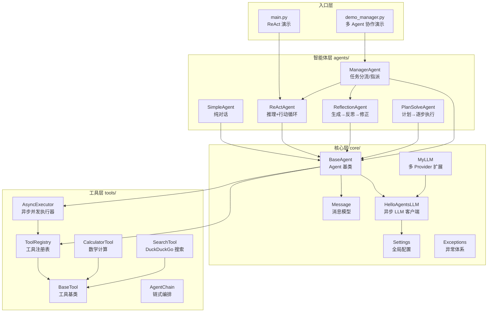
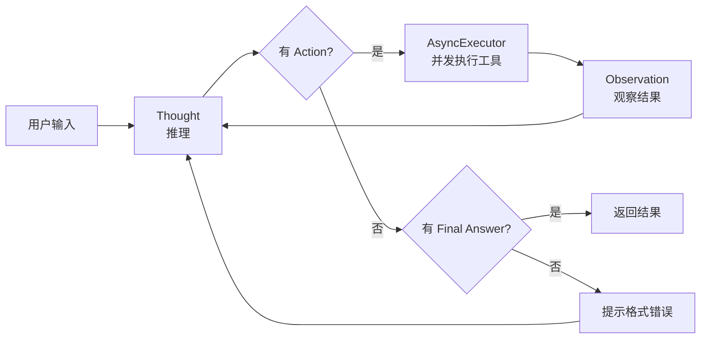
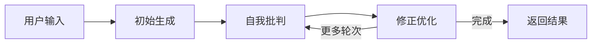
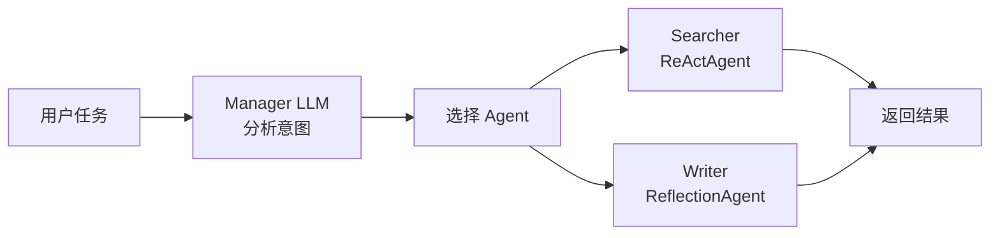

# Yuan-agent 项目全景分析

## 📌 项目概览

**Yuan-agent** 是一个基于 Python 的多智能体（Multi-Agent）协作框架，实现了多种经典 Agent 设计模式。项目采用异步架构（`asyncio`），通过 OpenAI 兼容接口调用大语言模型，具备工具调用、并发执行和多 Agent 协作能力。

| 属性 | 值 |
|------|-----|
| 语言 | Python 3.13+ |
| 依赖 | `openai`, `python-dotenv`, `duckduckgo-search` |
| LLM 接口 | OpenAI 兼容 API（可切换 ModelScope 等） |
| 架构风格 | 异步（async/await） |
| 包管理 | `uv` + `pyproject.toml` |

---

## 🏗️ 整体架构



---

## 📂 文件结构详解

```
Yuan-agent/
├── .env                          # 环境变量（API Key 等，当前为空）
├── pyproject.toml                # 项目元数据与依赖
├── main.py                       # 入口 1：ReAct Agent 并发演示
├── demo_manager.py               # 入口 2：Manager 多 Agent 协作演示
└── hello_agents/                 # 核心包
    ├── core/                     # 基础设施层
    │   ├── agent.py              # BaseAgent 抽象基类
    │   ├── config.py             # Settings 全局配置（单例）
    │   ├── llm.py                # HelloAgentsLLM（异步 OpenAI 客户端）
    │   ├── my_llm.py             # MyLLM（ModelScope 扩展）
    │   ├── message.py            # Message TypedDict + 工厂函数
    │   └── exceptions.py         # 异常体系
    ├── agents/                   # Agent 实现层
    │   ├── simple_agent.py       # 纯对话 Agent
    │   ├── react_agent.py        # ReAct 模式（推理→行动→观察循环）
    │   ├── reflection_agent.py   # 反思模式（生成→批判→修正）
    │   ├── plan_solve_agent.py   # 计划-求解模式
    │   └── manager_agent.py      # 管理者模式（任务指派/分流）
    └── tools/                    # 工具系统
        ├── base.py               # BaseTool 抽象类
        ├── registry.py           # ToolRegistry 工具注册表
        ├── async_executor.py     # AsyncExecutor 并发执行器
        ├── chain.py              # AgentChain 链式编排
        └── builtin/              # 内置工具
            ├── calculator.py     # 数学计算器
            └── search.py         # DuckDuckGo 搜索
```

---

## 🔑 核心模块详解

### 1. 配置系统 — [config.py](file:///d:/Program%20Files/github/private/AI_agent_study/hello-agents/code/Yuan-agent/hello_agents/core/config.py)

通过 `dotenv` 自动加载 `.env` 文件，暴露全局 `settings` 单例：

| 配置项 | 默认值 | 说明 |
|--------|--------|------|
| `LLM_MODEL_ID` | `gpt-3.5-turbo` | 模型标识 |
| `LLM_API_KEY` | 空 | API 密钥 |
| `LLM_BASE_URL` | `https://api.openai.com/v1` | 接口地址 |
| `LLM_TIMEOUT` | 60s | 请求超时 |
| `AGENT_MAX_STEPS` | 10 | Agent 最大迭代步数 |
| `AGENT_DEFAULT_TEMPERATURE` | 0.7 | 默认采样温度 |
| `DEBUG` | False | 调试模式开关 |

### 2. LLM 客户端 — [llm.py](file:///d:/Program%20Files/github/private/AI_agent_study/hello-agents/code/Yuan-agent/hello_agents/core/llm.py)

`HelloAgentsLLM` 是统一的 LLM 接口，基于 `AsyncOpenAI`：

| 方法 | 类型 | 说明 |
|------|------|------|
| `astream_chat()` | async | 异步流式调用，逐 token 输出 |
| `athink()` | async | 异步非流式调用（接收 dict 列表） |
| `think()` | sync | 同步兼容方法（内部调用 `athink`） |

> [!NOTE]
> `MyLLM`（[my_llm.py](file:///d:/Program%20Files/github/private/AI_agent_study/hello-agents/code/Yuan-agent/hello_agents/core/my_llm.py)）扩展了 `HelloAgentsLLM`，增加了 ModelScope Provider 支持，可通过 `provider="modelscope"` 切换。

### 3. 消息模型 — [message.py](file:///d:/Program%20Files/github/private/AI_agent_study/hello-agents/code/Yuan-agent/hello_agents/core/message.py)

使用 `TypedDict` 定义兼容 OpenAI 的消息格式，提供 4 个工厂函数：
- `system_message()` / `user_message()` / `assistant_message()` / `tool_message()`

### 4. 异常体系 — [exceptions.py](file:///d:/Program%20Files/github/private/AI_agent_study/hello-agents/code/Yuan-agent/hello_agents/core/exceptions.py)

```
HelloAgentsError (基类)
├── LLMError          ← LLM 调用失败
├── ToolError         ← 工具执行失败
│   └── ToolNotFoundError  ← 工具未注册
└── AgentStepError    ← Agent 步进逻辑错误
```

---

## 🤖 Agent 模式详解

### ① SimpleAgent — 纯对话

最简单的 Agent，直接将用户输入发给 LLM 并返回结果。适合嵌入 Chain 作为中间环节。

### ② ReActAgent — 推理 + 行动循环



> [!IMPORTANT]
> ReActAgent 使用 `self.llm.think()`（同步方法）而非异步方法调用 LLM，但工具执行通过 `AsyncExecutor` 实现并发。

### ③ ReflectionAgent — 反思优化



通过 **生成 → 反思 → 修正** 的迭代循环提升输出质量，默认迭代 1 轮。

### ④ PlanSolveAgent — 计划-求解

先让 LLM 制定完整计划，再逐步执行。支持工具调用。

> [!WARNING]
> `PlanSolveAgent.run()` 是**同步方法**（非 async），与其他 Agent 的异步接口不一致，调用 `parse_and_execute_action()` 方法在 `BaseAgent` 中并不存在 — 这是一个 **bug**。

### ⑤ ManagerAgent — 任务管理者



接受 `agents_pool` 字典，LLM 决策后将任务指派给最合适的子 Agent 执行。

---

## 🔧 工具系统

| 组件 | 文件 | 职责 |
|------|------|------|
| `BaseTool` | [base.py](file:///d:/Program%20Files/github/private/AI_agent_study/hello-agents/code/Yuan-agent/hello_agents/tools/base.py) | 抽象基类，定义 `name`/`description`/`run()` |
| `ToolRegistry` | [registry.py](file:///d:/Program%20Files/github/private/AI_agent_study/hello-agents/code/Yuan-agent/hello_agents/tools/registry.py) | 工具注册/查找/列表 |
| `AsyncExecutor` | [async_executor.py](file:///d:/Program%20Files/github/private/AI_agent_study/hello-agents/code/Yuan-agent/hello_agents/tools/async_executor.py) | 正则解析 Action → 并发执行 → 合并 Observation |
| `AgentChain` | [chain.py](file:///d:/Program%20Files/github/private/AI_agent_study/hello-agents/code/Yuan-agent/hello_agents/tools/chain.py) | 链式顺序执行多个 Agent |
| `CalculatorTool` | [calculator.py](file:///d:/Program%20Files/github/private/AI_agent_study/hello-agents/code/Yuan-agent/hello_agents/tools/builtin/calculator.py) | 数学表达式计算（`eval`） |
| `SearchTool` | [search.py](file:///d:/Program%20Files/github/private/AI_agent_study/hello-agents/code/Yuan-agent/hello_agents/tools/builtin/search.py) | DuckDuckGo 搜索引擎 |

> [!CAUTION]
> `CalculatorTool` 使用 `eval()` 执行任意 Python 表达式，存在**安全风险**。生产环境应替换为安全的数学解析器（如 `asteval` 或 `simpleeval`）。

---

## ⚠️ 已发现的问题

| # | 严重性 | 位置 | 问题描述 |
|---|--------|------|----------|
| 1 | 🔴 Bug | `PlanSolveAgent.run()` L70 | 调用 `self.parse_and_execute_action()` 方法，但 `BaseAgent` 中不存在该方法，运行时会抛出 `AttributeError` |
| 2 | 🟡 不一致 | `PlanSolveAgent.run()` L36 | `run()` 未声明为 `async`，与其他 Agent 的异步接口契约不一致 |
| 3 | 🟡 混用 | `ReActAgent.run()` L47 | LLM 调用使用同步 `self.llm.think()` 而非 `await self.llm.athink()`，在异步上下文中会阻塞事件循环 |
| 4 | 🟠 安全 | `CalculatorTool` | `eval()` 可执行任意代码 |
| 5 | 🟡 配置 | `.env` | 文件为空，需要用户手动配置 API Key |
| 6 | 🟡 依赖 | `pyproject.toml` | 缺少 `duckduckgo-search` 依赖声明（`SearchTool` 需要） |
| 7 | 🟢 初始化 | `MyLLM.__init__()` L40 | 父类 `HelloAgentsLLM.__init__()` 不接受 `provider` 参数，传入会报 `TypeError` |

---

## 🚀 运行方式

```bash
# 1. 配置环境变量
# 编辑 .env 文件，填入 LLM API 凭证

# 2. 运行 ReAct Agent 演示
python main.py

# 3. 运行 Manager 多 Agent 协作演示
python demo_manager.py
```

---

## 💡 总结

Yuan-agent 是一个结构清晰的多智能体教学/研究框架，覆盖了 5 种经典 Agent 设计模式。架构分层合理（Core → Tools → Agents → Entry），支持异步并发和工具扩展。主要待改进点是 `PlanSolveAgent` 的 bug 修复、异步接口统一，以及安全性加固。
